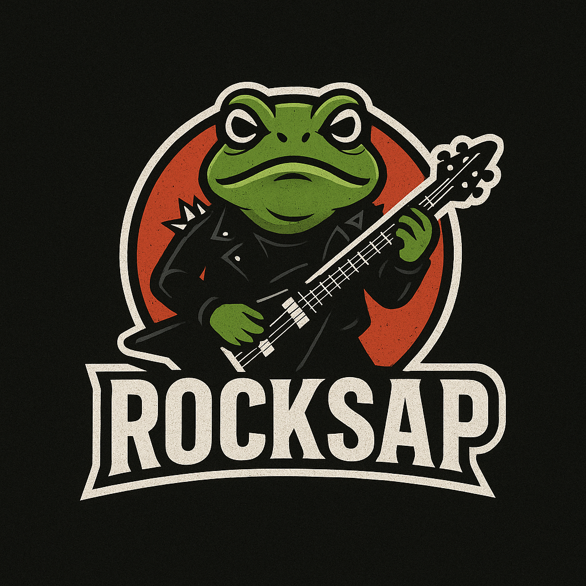

<h2 align="left"><b>Kevin Marques</b></h2>

Front-end Developer | Web Dev | Técnico em Redes de Computadores | Graduando em ADS (Análise e Desenvolvimento de Sistemas)

  
  
  

###

  
  

###

###

<h3 align="left">💻 Tecnologias que utilizo | Technologies I work with:</h3>

  
  
  
  
  
  
  
  
  
  
  
  
 

###

<h3 align="left">🎓 Certificações | Certifications:</h3>

<ul>
  <li>5G Technology Fundamentals by Huawei</li>
  <li>Amazon AWS Cloud Practitioner by Amazon</li>
  <li>Google Cybersecurity Professional Certificate by Coursera</li>
  <li>LGPD (Lei Geral de Proteção de Dados) by Fundação Bradesco</li>
</ul>

###

 

###
